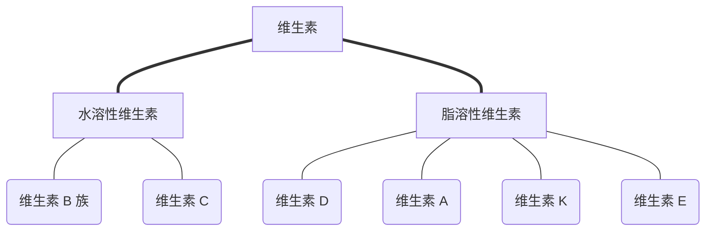

## 第 1 章 氨基酸

### 知识概要

#### ==**氨基酸的分类**==

##### 疏水 (hydrophobic) 氨基酸

Phe, Ala, Leu, Met, Ile, Trp, Pro, Val

##### 亲水 (hydrophilic) 氨基酸

**Basic**: His, Arg, Lys
**Polar uncharged**: Cys, Gly, Gln, Asn, Ser, Tyr, Thr
**Acidic**: Asp, Glu

##### 必需氨基酸 (essential AAs)

指人体或动物体**必不可少**，但却**不能合成**，或者虽能合成，但**合成量不够**，**必须从食物中补充的**氨基酸，包含：
Lys 赖, Trp 色, Phe 苯丙, Met 甲, Thr 苏, Ile 异亮, Leu 亮,  Val 缬, ==Arg 精, His 组 (semi-essential 半必须)==

##### 非必需氨基酸

Ala 丙, Asn 天冬酰胺, Asp 天冬, Gln 谷氨酰胺, Glu 谷, Pro 脯, Ser 丝, Cys 半胱, **Tyr 酪**, Gly 甘

#### **氨基酸的==性质==**

##### 共同性质

- **缩合反应** (condensation)
  $$
  \ce{-COOH + H2N\bond{-} ->[enzyme] -CO-NH\bond{-} + H2O}
  $$

- **手性** (chirality)
  除**甘氨酸** Gly 以外均为手性分子，**均为 L 型**。

- **酸碱解离性质与两性离子**
  $\ce{-NH2}$ 解离呈碱性，$\ce{-COOH}$ 解离呈酸性，弱于单独存在的胺和羧酸。
  一个氨基酸分子**内部的酸碱反应**使氨基酸能**同时带有正负两种电荷**，以这种形式存在的离子被称为**两性离子** (zwitterions)

- **氨基酸等电点** (isoelectric point, pI) **的计算**
  分析解离过程，找到净电荷为 0 的解离区间，取区间上下界的 $\mathrm p K_\text a$ 取平均值。（见 Week 3 [作业](https://share.goodnotes.com/s/SS6WFpXiNGId1vMDHEnlFY)）

- **R 基团的结构变化和化学反应性质**

  | 反应类型                         | 反应试剂                                       | 主要反应产物                         | 用途                          |
  | -------------------------------- | ---------------------------------------------- | ------------------------------------ | ----------------------------- |
  | $\alpha$-氨基                    | $\ce{HNO2}$                                    | 羟酸，$\ce{N2}$                      | Van Slyke 定氮                |
  | $\alpha$-氨基                    | 2,4–二硝基氟苯 (DNFB)<br />苯异硫氰酸酯 (PITC) | DNP-AA<br />PTC AA, PTH AA           | 多肽和蛋白质 N–端氨基酸的鉴定 |
  | $\alpha$-氨基<br />$\alpha$-羧基 | 茚三酮                                         | 紫色物质<br />==**Pro 为黄色物质**== | 氨基酸的定性和定量            |

##### ==个别氨基酸的侧链性质对蛋白质功能的贡献==

- 三种**芳香族氨基酸** (Phe 苯丙, Tyr 酪, Trp 色) 含有的**苯环结构赋予蛋白质紫外吸收性质**，最大吸收峰为 **280nm**
- **疏水**氨基酸**侧链间形成疏水键**驱动蛋白质**折叠**
- ==**侧链**含 $\ce{-OH}$ 的氨基酸 (Ser 丝, Thr 苏, Tyr 酪) 可作为**亲核试剂**参与多种酶的催化，还可以被**磷酸化修饰**调节多种酶的活性==
- 两个 **Cys 半胱 残基侧链** $\ce{-SH}$ 氧化为 $\ce{-S-S\bond{-}}$ 可用来**稳定蛋白质三维结构**
- **碱性氨基酸**
  - ==His 组== 侧链**咪唑基** $\mathrm p K_\text a \approx 7$，在**生理 pH 下**既可以充当**质子供体**，又可以充当**质子受体**，从而[参与多种酶的催化](#广义的酸碱催化 general acid-base catalysis)。
  - ==Lys 赖 和 Arg 精== **侧链上的氨基和胍基**既可以作**亲核试剂**，参与多种酶的催化，也可以发生**共价修饰**，如**乙酰化和甲基化**
- ==Asp 天冬 和 Glu 谷== 的侧链在特定条件下可以作为**质子供体/受体**参与酶的催化

### 名词解释

- **non-proteinogenic AAs**
  **非蛋白质氨基酸，非标准氨基酸**
  在蛋白质生物合成时**不能直接参入到肽链之中**的氨基酸。
- **proteinogenic AAs**
  **蛋白质氨基酸，标准氨基酸**
  由遗传密码**直接编码**，在蛋白质生物合成中，由专门的 tRNA 携带，**直接参入**到正在延伸的**肽链**之中的氨基酸。
- **essential AAs**, EAAs
  **必需氨基酸**
  人体或动物体**必不可少**，但却**不能合成**，或者虽能合成，但**合成量不够**，**必须从食物中补充的**氨基酸。
- **zwitterion**
  **两性离子，兼性离子**
  同时带有正负电荷但总体呈电中性的分子化合物。
- **isoelectric point, pI**
  **等电点**
  使分子解离出静电荷为零的 pH 值。
- **hydropathy**
  **疏水性**
  基团对疏水环境的相对亲和能力。
- **electrophoresis**
  **电泳**
  带电的颗粒或生物分子在外加电场作用下，向带相反电荷的电极做定向移动的现象。
- **chromatography**
  **层析**

## 第 2 章 蛋白质的结构

### 知识概要

#### 肽的结构

- ==**肽 (peptide)** 就是氨基酸之间发生缩合反应后通过酰胺键或肽键相连的聚合物。==

- 构成肽的每一个氨基酸单位被称为**氨基酸残基 (residue)**。

- **肽的分类**主要依据氨基酸残基的数目

  - 2个氨基酸形成的肽 → 二肽
  - 3个氨基酸构成的肽 → 三肽，以此类推

- 依据氨基酸残基的数目，肽可分为

  - 寡肽 (**Oligo**peptide) 2~10 aa
  - 多肽 (**Poly**peptide) 11~50 aa
  - 和蛋白质 (**Protein**) >50 aa

- 天然存在的活性肽：

  | 类型和种类                           | 来源       | 类别 | 功能               | 备注                                 |
  | ------------------------------------ | ---------- | ---- | ------------------ | ------------------------------------ |
  | 谷胱甘肽（非核糖体合成）             | 动植物细胞 | 三肽 | 抗氧化             | 第一个肽键为$\gamma$-肽键            |
  | 促甲状腺素释放因子 TRF（核糖体合成） | 下丘脑     | 三肽 | 促进甲状腺激素释放 | N– 端发生焦谷氨酰化，C– 端发生酰胺化 |

#### ==蛋白质的结构==

- **蛋白质可能含有一条或多条肽链。**
  - 一条多肽链：单体蛋白 (monomeric protein)
  - 多条多肽链：寡聚蛋白 (multimeric protein)
    - 同种肽链：同源寡聚体
    - 两种或多种不同肽链：异源寡聚体
      e.g. Hb, 2 $\alpha$-chain and 2 $\beta$-chain.

- **蛋白质可能含有非蛋白质成分。**

  - 多肽链 + 辅助因子：金属离子、辅酶/辅基
    e.g. 羧肽酶 辅助因子 $\ce{Zn^{2+}}$，乳酸脱氢酶 辅酶 辅酶 I，血红蛋白 辅基 血红素
  - 多肽链 + 其他修饰

- **蛋白质可大可小**。

##### 一级结构 primary structure

也称共价结构，独特的==氨基酸序列==，由基因决定。书写由 N 端到 C 端。

肽键具有部分双键的性质，多为 trans，==X–Pro== 时为 cis (PPI 催化)。与肽键相关的6个原子共处肽平面。

###### **蛋白质的二面角** (dihedral angle)

$\varphi$ 为 $\ce{C_\alpha-N}$ 单键的旋转角度，$\psi$ 为 $\ce{C_\alpha-C}$ 单键的旋转角度。骨架呈 W 形时 $\varphi = \psi = 180\degree$。Ramachandran 作图表示了在侧链残基限制下所有可能存在的 $(\varphi, \psi)$ 取值范围。

##### 二级结构 secondary structure


多肽链的==**主链**骨架 (backbone) 本身==（不包括R基团）在**局部**有规律的**折叠和盘绕**，它是由氨基酸残基非侧链基团之间的氢键决定的。包含：

###### $\alpha$-螺旋和其他螺旋

- 第 $n$ 位的羰基 O 与第 $n+4$ 位的氨基 H 形成氢键起稳定作用，封闭的环含 13 个原子
- 每隔 3.6 残基，螺旋上升一圈
- 主要是右手螺旋
- 偶极矩作用
- **Ala 丙**, Cys 半胱, **Leu 亮**, **Met 甲硫**, **Glu 谷**, Gln 谷氨酰胺, His 组, **Lys 赖**
- 亲水、疏水、两亲：螺旋轮作图

###### $\beta$-折叠

- 至少两条肽段，每一条被称为 $\beta$-strand ($\beta$ 股)，相邻肽段平行排列，肽键形成氢键
- 侧链垂直与两相邻肽平面交线，交替分布在片层两侧
- 平行/反平行，反平行更稳定（$\ce{N-H-O}$ 几乎处于同一直线）
- 0.325 nm/aa 平行，0.347nm/aa 反平行
- $\beta$ 股来源：同肽链不同肽段/不同肽链/不同蛋白质
- Val, Ile, Phe, Tyr, Trp

###### $\beta$-转角

- $180\degree$ 回折，4 个连续的残基，残基 #1 $\ce{C=O...H-N}$ 残基 #4
- Gly, **Pro** 常出现
- 利于反平行 $\beta$ 折叠形成
- The, **Gly**, Ser, Asp, Asn, **Pro**

###### $\beta$-凸起

- 在  $\beta$ 折叠的一股中额外插入一个残基
- 主要在反平行折叠中

###### 环和无规卷曲

##### 三级结构 

是指多肽链在二级结构的基础上，进一步盘绕、卷曲和折叠，形成的包括==所有原子==在内的特定的三维结构。

- 主要通过氨基酸侧链以**次级键**（有时还有二硫键和金属配位键）维系
- 稳定三级结构的作用力主要包括==氢键、离子键、**疏水键**、范德华力==。

**构象 (conformation)**：一种蛋白质的全部三维结构。**构象的转变是由单键自由旋转造成的。**

确定三级结构的方法：
X-射线晶体衍射、核磁共振波谱 (<120 aa)、冷冻电镜、同源建模、机器学习预测

三级结构的结构部件：

###### 模体 motif

1. 是指在蛋白质或核酸**一级结构**上，特指具有特殊生化功能的**特定氨基酸或碱基序列**，因此被称为**序列模体 (sequence motif)**；

2. 是指具有特定功能的或作为一个独立结构域一部分的**相邻的二级结构的聚合体**，一般被称为**功能模体 (functional motif) 或 结构模体 (structural motif)**，相当于**超二级结构 (super-secondary structure)**。

**常见模体**：

- β 发夹环：两个反平行 β 股由一个环相连
- β 折叠–α 螺旋–β 折叠，即 βαβ
- 卷曲螺旋和螺旋束：两个或多个 α 螺旋的聚合体
- α 螺旋–环–α 螺旋 (EF 手相)，环中通常有 $\ce{Ca^{2+}}$
- α 螺旋–β 转角–α 螺旋，即 αβα，与 DNA 结合
- Rossmann 折叠
- 希腊钥匙
- β 螺旋

###### 结构域 domain

主要是球状蛋白的一种结构层次。在一个蛋白质分子内的相对独立的球状**结构**和/或**功能模块**，是由若干个结构模体组成的相对独立的**球形结构单位**。

1. α结构域：完全由α螺旋组成

2. β结构域：只含有β折叠、β转角和不规则环结构

3. α/β结构域：由β股和起连接的α螺旋片段组成

4. α+β-结构域：由独立的α螺旋区和β折叠区组成
5. 交联结构域：缺乏特定的二级结构元件，但由几个二硫键或金属离子起稳定作用

##### 四级结构

具有**两条和两条以上多肽链**的寡聚蛋白质或多聚蛋白质才会有四级结构。**不以二硫键（共价键）相连**。其内容包括亚基的种类、数目、空间排布以及亚基之间的相互作用。

==主要作用力：氢键、疏水键、范德华力、离子键（亚基间作用）==

#### 蛋白质的折叠历程与结构预测

##### ==基本规律==

1. ==Anfinsen 法则：**一级结构决定三级结构。**==
2. 在细胞内，不同的蛋白质可能具有不同的折叠路径，体内**绝大多数**蛋白质折叠需要**分子伴侣**的帮助；
3. 蛋白质的折叠是协同和有序的过程，驱动蛋白质（特别是球状蛋白质）折叠的**主要动力**是**疏水键**，其他次级键也有作用；
4. 蛋白质的折叠伴随着自由能的降低（-20.92kJ/mol ~-83.68kJ/mol），但是蛋白质折叠并**不是通过随机尝试**找到自由能最低的构象的；
5. 最终得到的蛋白质构象不是僵硬的，而是具有一定的柔性。
6. 某些蛋白质折叠还需要**蛋白质二硫化物异构酶 (PDI) 和肽酰脯氨酰顺反异构酶 (PPI)** 的帮助。

##### 折叠历程

1. **分子伴侣 molecular chaperone**：帮助体内蛋白质折叠的一类蛋白质。

- 在正确的时间和地点**促进正确折叠**
- 帮助**错误**折叠的蛋白**重新折叠**成正确的构象

常见：**HSP70，伴侣蛋白家族**

- **HSP70** 通过与部分折叠的蛋白质的**疏水区域的临时结合**而促进蛋白质的正确折叠。
- **伴侣蛋白**则形成大的**桶状结构容纳**部分折叠的蛋白质完成折叠。

折叠好立即释放，参与新生蛋白质的折叠。

2. 滑雪模型

3. **PDI/PPI** 辅助二硫化/顺反异构

体外：

1. 启动—快速地形成局部二级结构，即折叠核。此过程是可逆的；
2. 折叠核协同聚合成结构域；
3. 结构域经熔球体，最终形成具有完整三维结构的蛋白质。熔球被认为是疏水塌陷的结果，这样的状态含有某些二级结构，但还没有形成正确的三级结构。

##### 错误折叠相关疾病

- 海绵状脑病：朊蛋白 (prion protein, PrP^sc^)，催化正常的 PrP^c^ 转变为 PrP^sc^（能抵抗水解）
- 囊性纤维变性：CFTR 错误折叠导致无法排出细胞内 $\ce{Cl-}$，细胞吸收外环境粘液水分导致粘液变稠阻碍呼吸，反复感染。

##### 结构预测

- 二级结构：可行。局部结构，明显倾向性。
- 三级结构：非常困难，已有突破。

#### 蛋白质组及蛋白质组学

- **蛋白质组 (proteome)**：是指某一物种所有基因表达的全部蛋白质及其存在方式，即一个基因组、一个细胞或组织所表达的全部蛋白质成分。

- **蛋白质组学 (proteomics)**：是对蛋白质性质和功能的大规模研究，研究不同蛋白质如何相互作用以及它们在生物体内发挥的作用。

- 主要研究方法：**双向电泳和质谱分析**

### 名词解释

- **peptide**
  **肽**
  氨基酸之间发生缩合反应后通过肽键相连的聚合物。

- **peptide plane**
  **肽平面**
  蛋白质分子中与肽键相关的 6 个原子共同组成的平面。

- ==**dihedral angle**==
  **二面角**
  在肽链中与同一个 $\ce{C_\alpha}$ 相连的两个肽平面的旋转角度 $\varphi$ 和 $\psi$。
- **poly-amino acids**
  **多聚氨基酸**
- **amphipathic helix**
  **两亲螺旋**
- **conformation**
  **构象**
  一种蛋白质的全部三维结构。构象转换仅由单键自由旋转造成，不涉及共价键的断裂和形成。
- **configuration**
  **构型**
  立体异构中一组特定的原子或基团在空间上的几何布局。构型转换伴随共价键的断裂和形成。
- **hydrophobic bond**
  **疏水键**
  疏水基团或疏水分子在水溶液里为避开水而相互聚集形成的作用力。
- **motif**
  **模体**
  1. 是指在蛋白质或核酸**一级结构**上，特指具有特殊生化功能的**特定氨基酸或碱基序列**，因此被称为**序列模体 (sequence motif)**；
  2. 是指具有特定功能的或作为一个独立结构域一部分的**相邻的二级结构的聚合体**，一般被称为**功能模体 (functional motif) 或 结构模体 (structural motif)**，相当于**超二级结构 (super-secondary structure)**。

- **domain**
  **结构域**
- **oligomer**
  **寡聚体**
  由一条肽链以上肽链组成的蛋白质称为寡聚体蛋白。
- **proteome**
  **蛋白质组**
  某一物种所有基因表达的全部蛋白质及其存在方式。

## 第 3 章 蛋白质的功能及其与结构之间的关系

### 知识概要

#### ==蛋白质的功能==

##### 生物功能试剂

- 生物催化剂：酶 e.g. 核糖核酸酶
- 信号转导 e.g. 胰岛素及其受体
- 基因表达调控 e.g. 转录因子
- 免疫 e.g. 抗体
- 运输和贮存 e.g. Hb, Mb
- 结构支持 e.g. 毛发、胶原
- 运动 e.g. 肌动蛋白、肌球蛋白
- 奇异功能 e.g. 南极鱼的抗冷冻蛋白

##### ==兼职蛋白 moonlighting proteins==

兼有几种甚至多种不同功能的蛋白质。

e.g. **3-磷酸甘油醛脱氢酶**：

- 糖酵解 <u>四聚体</u> 细胞质
- 尿嘧啶-DNA 糖苷酶 <u>单体</u> 细胞核 DNA 碱基切除修复

#### ==蛋白质结构与功能之间的关系==

##### 基本规则

1. 蛋白质的==**一级结构决定其三维结构**==，==**三维结构**直接**决定**蛋白质的**功能**==。
2. 大多数蛋白合成后就会折叠成特定的三维结构，行使特定的生物学功能。一旦结构（特别是高级结构）破坏，其功能随之丧失。
3. 蛋白质在行使功能的时候一般需要**三维结构或构象的变化**。
4. 结构相似的蛋白质一般具有相似的功能。
5. 功能相似的蛋白具有相同或基本相同的三维结构，一级结构的差异往往能显示它们在进化上的亲缘关系，这是研究分子进化的基础。
6. 一级结构相似的蛋白质往往具有共同的起源。
7. 许多疾病是蛋白质结构异常引起，属于构象病。

e.g. 细胞色素 c

##### 蛋白质进化的两种情形

- **类似物 analog**：具有相同功能，但起源于**不同祖先基因**的蛋白质。趋同进化 (convergent evolution) 产物。
- **同源物 homolog**：存在于不同生物/同种生物，来源于某一**共同祖先基因**的蛋白质。
  - **种间同源物 ortholog**：来自于不同物种的由垂直家系进化而来的蛋白质，通常保留与原始蛋白相同的功能（也不尽然）。
  - **种内同源物 paralog**：旁系同源物，同一物种内由于基因复制、分离产生的同源物。

##### 几种重要蛋白质的结构与功能

###### 纤维状蛋白 fibrous protein

- **α 角蛋白 ** 头发

  **一级结构** 311~314 aa

  **二级结构** 中央形成典型 α 螺旋，两端非螺旋区。

  螺旋区由七肽重复序列 $\ce{(\bond{-}a\bond{-}b\bond{-}c\bond{-}d\bond{-}e\bond{-}f\bond{-}g)_n}$ 组成，其中 a, d 为疏水氨基酸，使得两个 α 角蛋白分子能通过 a, d 的疏水基团结合，相互缠绕形成双股左手超螺旋，即卷曲螺旋。

  链间多个 $\ce{-S-S\bond{-}}$ 进一步提高 α 角蛋白的强度。

- **β 角蛋白** 蛛丝

  **一级结构** 富含 Ala 丙 和 Gly 甘，具有重复序列 Gly-Ala/Ser-Gly-Ala/Ser

  **二级结构** 主要是**有序的反平行 β 折叠**，还有一些**无序 α 螺旋和 β 转角**环绕在其周围。Gly 和 Ala/Ser 分别分布于折叠片层的两侧，使得相邻的 β 折叠更加紧密地堆积形成网状结构，从而赋予丝较高的抗张性能。同时 α 螺旋又使蛛丝具有一定的柔软性。

- **胶原蛋白**

  胶原蛋白的基本组成单位是由 3 条 α 链组成的原胶原分子。

  **一级结构** ~ 1/3 Gly, ~ 12% Pro，三种羟基化的 Pro 和 Lys

  每条肽链具有重复的 $\ce{Gly-Pro/Lys-Pro/Lys}$ 三联体序列，难以形成 α 螺旋和 β 折叠。

  ==有利于形成原胶原特有二级结构——**三股螺旋 (triple helix)。**==

  羟基化为了弥补 Pro 亚氨基形成肽键后造成氢键供体不足。羟基化需要维生素 C。缺乏维生素 C 引起坏血病。

###### 球状蛋白 globular protein

珠蛋白家族 (globin family) 均含有血红素辅基 (heme)，能可逆结合氧气，含有珠蛋白折叠结构模体。有 Mb, Hb, Ngb, Cygb。

- **肌红蛋白 Mb**

  **一级结构** 一条肽链，紧密结合一个 heme

  **二级结构** 共有 8 段 α 螺旋

  **三级结构** 1959。获得

  疏水口袋，heme Fe^2+^ 与 His F8 (近端, proximal) 结合藏在洞中， ==His E7 (远端, distal) 防止 Fe^2+^ 被氧化。==

- **血红蛋白 Hb**

  ==四个亚基 (α~1~, β~1~ α~2~, β~2~)，具有四级结构。==每一个亚基称为珠蛋白，单个亚基一级结构与 Mb 相差较大，但二级、三级结构相似。

  - **正协同效应**
    一个亚基结合 $\ce{O2}$ 后构象变化，使其他亚基对 $\ce{O2}$ 的亲和力突然增强，造成氧合曲线呈 S 形。解释：序变、齐变。==T 态：低亲和，R 态：高亲和。==

  - **波尔效应**
    **$\ce{H+}$ 和 $\ce{CO2}$ 促进 Hb 释放 $\ce{O2}$ 的现象。**原因是 $\ce{H+}$ 和 $\ce{CO2}$ 能与 Hb 特定位点结合，促进 Hb 由 R 态 转为 T 态。$\ce{CO2}$ 可以通过水溶解离产生 $\ce{H+}$ 和自身与亚基产生可逆反应（一种别构效应）两种途径产生波尔效应。

  - **[别构效应](#别构调节)**
    **除 $\ce{O2}$ 以外的各种配体在血红素铁以外的位点与 Hb 结合，导致 Hb 的构象发生变化，进而影响到 Hb 氧合能力的现象。**e.g. 2,3–BPG 与两条 β 链结合导致由 R 态转为 T 态。

    分子水平的母爱：HbF 对 $\ce{O2}$ 的亲和力明显高于 HbA，有利于胎儿从母亲胎盘获取氧气。原因是 HbF 亚基为 α~2~γ~2~，无法结合 BPG。

###### 膜蛋白 membrane protein

###### 天然无折叠蛋白质 NUP

生理条件下，缺乏特定的二级结构和三级结构，处于完全无折叠或部分无折叠状态，但仍然具有功能的一类蛋白质。

- 完全无折叠 (~10%)/部分无折叠 (无折叠区域 > 50 aa)
- 一般含有较多 Gln, Ser, Pro, Glu, Lys，且侧链较大的疏水氨基酸很少。
- 信号转导、细胞周期调控、基因表达调控、翻译后加工、RNA/蛋白质分子伴侣
- 必须处在无折叠状态/与特定配体结合折叠行使功能

#### 蛋白质功能预测

1. 基于序列
2. 基于结构
3. 结构/序列比对
4. 基于模体
5. 基于“连坐”

### 名词解释

- **moonlighting protein**
  **兼职蛋白**
  兼有多种功能的蛋白质。
- **analog**
  **类似物**
  具有相同功能，但起源于**不同祖先基因**的蛋白质。趋同进化 (convergent evolution) 产物。
- **homolog**
  **同源物**
  存在于不同生物/同种生物，来源于某一**共同祖先基因**的蛋白质。
- **ortholog**
  **种间同源物**
  来自于不同物种的由垂直家系进化而来的蛋白质，通常保留与原始蛋白相同的功能。
- **paralog**
  **种内同源物**
  又名旁系同源物，同一物种内由于基因复制、分离产生的同源物。

## 第 4 章 蛋白质的理化性质、分类及研究方法

### 知识概要

#### ==蛋白质的理化性质==

- 紫外吸收：最大吸收峰为 280 nm
- 两性解离及 pI：pI 不能直接计算，只能使用 **等电聚焦** 或 **等电点沉淀** 等方法进行测定
- 胶体性质
- 沉淀反应：**盐析**（硫酸铵最常用）、**pI 沉淀**、有机溶剂引起的沉淀和重金属盐作用造成的沉淀
- ==**变性**==、复性
- **水解**
- 颜色反应

##### 变性 denaturation

蛋白质受到某些理化因素的作用，其特有的**三维结构**受到破坏、生物活性随之丧失的现象。

**物理因素**：加热、冷却、机械作用、流体压力、辐射
**化学因素**：**强酸强碱**、高浓度盐、==**尿素**==、重金属盐、疏水分子、**有机溶剂**

**主要理化性质变化**：(1) 生物活性丧失 (2) 水溶性下降 (3) 更容易被水解 (4) 黏度增加 (5) 失去结晶能力

##### 水解

蛋白质在**强酸、强碱并加热**条件或**蛋白酶的催化**下均能够发生水解。

- **酸水解**破坏 Trp 和三种羟基氨基酸，将 Gln, Asn 水解为 Glu, Asp

- **碱水解**破坏多数氨基酸，产生**消旋现象**，但不破坏 Trp

- **酶水解**效率高，不产生消旋作用，也不破坏氨基酸，但不同蛋白酶对肽键特异性不同

  ```mermaid
  graph LR
  	蛋白酶 --- 内切蛋白酶
  	蛋白酶 --- 外切蛋白酶
    外切蛋白酶 --- 氨肽酶
    外切蛋白酶 --- 羧肽酶
  ```

  | 蛋白酶               | 特异性                                       |
  | -------------------- | -------------------------------------------- |
  | 羧肽酶 A             | C 端==除 R, K, P== 以外的氨基酸              |
  | 羧肽酶 B             | C 端只能是 ==R, K==                          |
  | 胰蛋白酶（内切）     | 任何与 ==R 和 K 羧基==形成的肽键             |
  | 胰凝乳蛋白酶（内切） | 任何与 ==F, W 和 Y 羧基==形成的肽键（除 P）  |
  | 胃蛋白酶             | 任何与 ==L, F, W, Y 氨基==形成的肽键（除 P） |

#### 蛋白质的研究方法

##### 蛋白质的纯化

- **准备工作**：目的、测活方法、原料
- **纯化步骤**：
  1. **破碎** 混合和匀浆
  2. **除渣** 离心
  3. **沉淀/浓缩** 硫酸铵/乙二醇
  4. **纯化** 层析
  5. **鉴定**

##### **蛋白质一级结构的测定**

- **直接测定**：化学测定/质谱
- **间接测定**：基因序列 → 氨基酸序列

### 名词解释

- **salting out**
  **盐析**
  在蛋白质溶液中加入一定量中性盐使蛋白质溶解度降低析出的现象。

- **denaturation**
  **变性**
  蛋白质受到某些理化因素的作用，其特有的**三维结构**受到破坏、生物活性随之丧失的现象。

## 第 5 章 核苷酸

### 知识概要

#### ==核苷酸的结构与组成==

##### ==碱基 nitrogenous base==

- **嘧啶 (pyrimidine) 碱基**
  - 胞嘧啶 Cytosine
  - 尿嘧啶 Uracil (RNA)
  - 胸腺嘧啶 Thymine
- **嘌呤 (purine) 碱基**
  - 腺嘌呤 Adenine
  - 鸟嘌呤 Guanine

甲基化——表观遗传、基因表达调控

##### 核苷 nucleoside

- 核苷是由**戊糖**和**碱基**通过 **β-N-糖苷键**形成的糖苷。
- 核苷中的戊糖有 D-核糖 和 2-脱氧-D-核糖 两种，它们都以呋喃型环状结构存在。
- D-核糖 → RNA，2-脱氧-D-核糖 → DNA，影响二级结构、稳定性。

###### 核苷的构象

核苷和核苷酸能以 cis/trans 存在。嘧啶核苷通常为 trans；自由的嘌呤核苷易形成 cis，但 DNA 和 RNA 螺旋中的嘌呤核苷主要为 trans。

##### 核苷酸 nucleotide

- 核苷酸是核苷的戊糖 **羟基** 发生**磷酸化**反应而形成的磷酸酯。
- 核糖核苷的磷酸酯为核糖核苷酸，脱氧核苷的磷酸酯为脱氧核苷酸。
- 自然界的核苷酸多为**核苷-5′-磷酸**。

###### 核苷单磷酸 (NMP)、核苷二磷酸 (NDP) 和核苷三磷酸 (NTP)

- NMP 是指核苷的单磷酸酯。
- 核苷单磷酸可以通过一次成酐反应形成 NDP。核苷二磷酸再通过一次成酐反应生成 NTP。

#### 核苷酸的生物学功能

1. **核酸合成的前体**：NTP → RNA，dNTP → DNA；
2. 能量货币，**ATP** 是细胞最为通用的，有时使用 UTP (糖原合成)、CTP (磷脂合成) 和GTP (蛋白质合成)；
3. <u>信号转导</u>，例如 cAMP 和 cGMP 作为某些激素的第二信使，鸟苷酸能够调节 G 蛋白的活性；
4. 作为其他物质的前体或辅酶/辅基的成分，如 ADP 为辅酶 I 和 II 的组分，鸟苷酸作为第一类内含子的辅酶；
5. 活化的中间物，如 UDPGlc 和 CDP-乙醇胺分别参与糖原和磷脂酰乙醇胺的合成；
6. 作为酶的别构效应物参与代谢的调节，如 ATP 为磷酸果糖激酶-1 的负别构效应物，AMP 作为糖原磷酸化酶的正别构效应物；
7. <u>调节基因表达</u>。例如 ppGpp 和 pppGpp 参与调节原核细胞蛋白质的合成。

## 第 6 章 核酸的结构与功能

### 知识概要

#### ==核酸的分类==

多个核苷酸通过 **3', 5'-磷酸二酯键**相连，形成 RNA 或 DNA。

###### **RNA 通常单链，DNA 通常双链的原因**

RNA处于单链状态可以自我折叠，形成二级结构和三级结构，这是形成 RNA 结构多样性的基础，使其在细胞内行使多项生物学功能。DNA 双链使其能充分行使作为遗传物质这项唯一功能。

###### ==**DNA 的第四个碱基通常是 T 的原因**==

C 自发脱氨基变为 U，通过引入 T 来识别正常的 U 和突变的 U。

#### ==核酸的一级结构==

- 核苷酸/碱基的排列顺序
- 从 5’ 到 3’ 书写
- DNA 一级结构贮存各种遗传信息
- **3', 5'-磷酸二酯键**
- 直接/间接测定

#### ==核酸的高级结构==

##### ==DNA 的二级结构==

DNA 的二级结构主要是各种形式的螺旋，特别是 **B-型双螺旋**，此外还有 A-型双螺旋、Z-型双螺旋等。

###### B-型双螺旋

Watson and Crick, 1953. 

1. 反平行双链，互相缠绕形成右手双螺旋
2. A–T, G–C 互补双链
3. 碱基对位于双螺旋内部，垂直于螺旋轴；脱氧核糖–磷酸骨架位于表面
4. 大小沟

==**碱基堆积力**==：碱基对在垂直方向相互作用所产生的力。==化学本质是碱基对之间的疏水键和范德华力。==

==双螺旋稳定的因素==：氢键、==**碱基堆积力**==、阳离子/带正电荷化合物对磷酸基团的中和。

###### ==DNA 的非标准二级结构==

特殊条件下形成其他非标准的二级结构。弯曲/十字形/三螺旋 H-DNA/碱基翻转/四链螺旋与 G-四联体/滑动错配
特殊条件：DNA 受到某些**蛋白质的作用**（如组蛋白）；DNA **本身所具有的特殊基序模体**。

##### ==DNA 的三级结构——超螺旋==

如果通过某种手段使得DNA双螺旋每一圈的碱基对数目多于或少于10对，将导致DNA双螺旋**过度缠绕**或**缠绕不足**；如果这时的DNA两端被固定或者DNA本来是共价闭环的，则DNA会因**张力无法释放**而自发地形成超螺旋结构。

- **正超螺旋**：左手超螺旋，过度缠绕引起
- **负超螺旋**：右手超螺旋，缠绕不足引起

##### RNA 的二级结构

主要取决于碱基组成。多数 RNA 仅由一条链组成，经**自我折叠**形成二级结构。不同区段互补序列间形成局部 **A-型双螺旋**，非互补碱基则游离在双螺旋外形成各种二级结构。少数病毒的基因组 RNA 由两条互补的链组成 A-型双螺旋。在 RNA 双螺旋内常发现 **G–U 碱基对**。

- 发夹结构

##### RNA 的三级结构

在二级结构基础上进一步折叠包装而成。

主要结构模体：**pseudo-knot, kissing hairpin**, tRNA 的倒 L 型三级结构。

###### tRNA：氨基酸的运载工具

- 单链，73~94 核苷酸，不少经过修饰
- 3’ 端最后三个总为 CCA，链内大多数碱基通过氢键相连。但几乎所有 tRNA 上不变的核苷酸都在三叶草结构上非氢键区域。
- 二级结构要素：环、茎、臂。三叶草结构，四环四茎。
- 三级结构形成原因：D 环上的碱基与不变碱基以及 TψC 环上的碱基之间的发生的氢键作用将 D 臂和 TψC 臂折叠到一起，并将三叶草二级结构弯曲成稳定的倒 L 型三级结构。

#### 核酸的功能

**DNA**
主要遗传物质

**RNA**
病毒遗传物质、核酶、蛋白质生物合成、引物、RNA 前体后加工、基因表达调控、蛋白质共翻译定向分拣、X 染色体失活

## 第 7 章 核酸的理化性质及研究方法

### 知识概要

#### ==核酸的理化性质==

- 紫外吸收 260 nm
- 酸碱解离
- 黏度
- 沉淀（无水乙醇）
- ==变性==、复性、杂交
- 水解

##### 变性 denaturation

核酸的变性是指在特定因素（如**加热**、**碱性 pH** 或**低离子强度**等或特殊的**化学试剂**的作用）作用下，其**双螺旋**区因**氢键和碱基堆积力的破坏**而发生解链的过程。其中并<u>不涉及共价键断裂</u>。

表征：

- ==**<u>紫外吸收升高</u>**==：增色效应 **hyper**chromic effect
  <!-- hyper- meaning high, chromic meaning color -->
- 浮力密度升高
- 黏度降低
- <u>生物学功能不变/丧失</u>

==$T_\text m$==：半数氢键受到破坏时的温度，DNA 的“熔点”。受到  **DNA 均一性、G–C 含量、离子强度、双螺旋长度和特殊化学试剂**的影响。

##### 复性 renaturation

当各种变性因素不复存在的时候，变性时解开的**互补**单链全部或部分恢复到天然双螺旋结构的现象称为**复性**。<u>热变性</u> DNA 一般经<u>缓慢冷却</u>后即可复性，此过程被称为**退火 (annealing)**。

表征与变性相反：

- ==**<u>紫外吸收减少</u>**==：减色效应 **hypo**chromic effect
- 浮力密度降低
- 黏度升高
- 生物活性恢复

影响因素：温度、离子强度、DNA 浓度、DNA 序列复杂度。

##### 核酸的水解

- **酸水解**
  糖苷键/磷酸二酯键对酸的敏感性不同。**糖苷键** > 磷酸二酯键；**嘌呤糖苷键** > 嘧啶糖苷键。
- **碱水解**
  RNA 的磷酸二酯键对碱异常敏感，得到 2’- 或 3’- 核苷酸的混合物；DNA 对碱的作用不敏感。生理意义是 DNA 作为遗传物质应当更稳定，而 RNA（尤其是 mRNA）是 DNA 的信使，完成任务后应当迅速降解。
- **酶促水解**
  RNAse H 内切与 DNA 杂交的 RNA, 核酸酶 S1 内切单链 DNA 或 RNA。

##### 核酸的分离、纯化和定量

- 抽取
  1. 两种核蛋白的分离
  2. 蛋白质的去除
  3. 核酸的沉淀
- 电泳
- 离心
- 层析
- 纯度检测和定量

##### DNA 一级结构的测定

- **末端终止法/双脱氧法**
  原理：ddNTP 参入可导致 DNA 复制的末端终止。
- **化学断裂法**
  原理：用特殊的化学试剂，处理待测的具有末端放射性同位素 (^32^P) 标记的单链 DNA 或者只有一条链的末端被放射性同位素标记的双链 DNA 片段，造成特定碱基的修饰、脱落和戊糖-磷酸骨架被特异性切割，从而产生一组长度不同的 DNA 链降解产物，经聚丙烯凝胶电泳分离和放射自显影之后，可直接读出待测 DNA 片段的核苷酸序列。
- **焦磷酸测序**
  在同一反应体系中发生由 4 种特异性酶催化的级联化学发光反应，在每一轮测序反应中，只加入一种 dNTP，若该 dNTP 与模板配对，聚合酶就可以将其掺入到引物链的 3′-端并释放出等量 PPi。PPi 可转化为可见光信号，并最终转化为一个峰值。每个峰值的高度与反应中掺入的核苷酸数目成正比。第一轮反应结束后，再加入下一种 dNTP，继续下一轮 DNA 链的合成。
- **深度测序**

##### RNA 一级结构的测定

- 逆转录为 cDNA
- 化学 &/ 酶学方法对放射性同位素标记的 RNA 部分消化后再进行聚丙烯酰胺凝胶电泳分析
- 质谱法

### 名词解释

- ***hyper*chromic effect**
  ***增*色效应**
  核酸变性时紫外吸收增强的现象。

- ***hypo*chromic effect**
  ***减*色效应**
  核酸复性时紫外吸收减弱的现象。
- **annealing**
  **退火**
  热变性 DNA 经缓慢冷却后复性的过程。
- **nucleation**
  **成核作用**
  两个互补单链分子间的接触以启动部分互补碱基的配对，是 DNA 复性的第一步。

## 第 8 章 酶学概论

### 知识概要

#### 酶的定义与化学本质

定义：酶是由细胞合成、在机体内行使催化功能的生物催化剂 (biocatalyst)。

##### 酶的化学本质

- **主要是蛋白质，极少数是 RNA。**
- 具有催化活性的 RNA 被称为**核酶 (riboenzyme)**。

#### 酶的催化性质

##### 酶促反应与非酶促反应的不同性质

- 酶促反应的速率高很多
- 酶促反应呈现饱和动力学
- 酶促反应有最适温度和最适 pH

##### 酶与非酶催化剂的共同性质

- 只能催化热力学允许的反应
- 反应完成后本身不被消耗或变化，可重复利用
- 对正反应和逆反应的催化作用相同
- 不改变平衡常数，只改变反应速率

##### ==酶特有的催化性质==

- ###### **高效性**

  酶比无机催化剂高效 10^6^ ~ 10^12^ 倍。

- ###### **在活性中心与底物结合**

  **活性中心** (active site)：酶分子上与底物结合并与催化作用直接相关的区域。

  - 结合基团 + 催化基团
  - **三维实体**，通常由在**一级结构上并不相邻**的氨基酸残基组成
  - 只占酶总体积的**很小一部分**
  - 中心多为**疏水**氨基酸残基，也有少量**亲水**氨基酸残基供底物结合和催化
  - 与底物结合为多重次级键，包括氢键、疏水键和范德华力
  - **专一性**在一定程度上取决于活性中心与底物在结构上的互补性
  - 构象并非固定，具有一定柔性

- ###### **专一性**

  - **绝对**专一性
    一种酶仅催化一个特定的反应，对底物有非常严格的要求。
  - **相对**专一性
    基团专一性/键专一性
  - **立体**专一性
    对具有立体异构体的底物只作用于其中的一种，而对另一种无效的性质。

  解释专一性的三种模型：

  - 锁–钥匙 Lock & Key
  - 诱导契合 Induced Fit
  - 三点附着 Three-point Attachment（立体专一性）

- ###### 反应条件温和

- ###### 对反应条件敏感、易失活

- ###### 受调控

- ###### 许多酶的活性需要辅助因子（多为维生素及其衍生物）

#### 酶的分类和命名

根据化学组成：

- 单纯酶
- 缀合酶/结合酶
  - 多肽链 + 辅因子 (cofactor)
  - RNA + 金属离子/蛋白质

根据结构特征：单体酶/寡聚酶/多酶复合物

###### 缀合酶

**辅因子 (cofactor)**：缀合酶除了多肽链外，结合的某些对热稳定的非蛋白质小分子或金属离子。丧失辅因子的酶被称为脱辅酶 (apoenzyme)，与辅因子结合在一起的酶被称为全酶 (holoenzyme)。包含：

- **辅酶 (coenzyme)**：与脱辅酶结合松散、使用透析或超滤等温和的方法就容易去除的有机小分子。
- **辅基 (prosthetic group)**：与脱辅酶结合紧密、使用透析或超滤的方法难以去除的有机小分子。
- 和**金属离子**。

#### 名词解释

- **active site**
  **[活性中心](#酶特有的催化性质)**
  酶分子上与底物结合并与催化作用直接相关的区域。
- **cofactor**
  **辅因子**
- **coenzyme**
  **辅酶**
- **prosthetic group**
  **辅基**

## 第 9 章 酶动力学

### 知识概要

#### 什么是酶动力学

酶动力学 (enzyme kinetics) 是研究**酶促反应影响因素及其变化规律**的一门学科。

#### 影响酶促反应的因素

- **外因**：温度、pH、离子强度、抑制剂/激活剂
- **内因**：**酶浓度、底物浓度**

#### ==米氏酶动力学==

对于一个单底物-单产物的反应可建立 Michaelis-Menten 模型：$\ce{E + S <=>[$k_1$][$k_{-1}$] ES ->[$k_2$] E + P}$，有米氏方程：
$$
% \left[\text{ES}\right] = \frac{\left[\text E_t\right]\left[\text S\right]}{\left[\text S \right] + K_\text m}\\
% v = \frac{k_2\left[\text E_t\right]\left[\text S\right]}{\left[\text S \right] + K_\text m}\\
% \left[\text S\right] \to \infty \ 时有\ v = k_2 \left[\text E_t \right] = V_\text{max}\\
v = \frac{V_\text{max}\left[\text S\right]}{\left[\text S \right] + K_\text m}
$$
方程成立需满足 3 个条件：

- 反应速率为初速率， 此时反应速率与酶浓度成正比
- 酶–底物复合物处于**稳态**，即 ES 浓度不发生变化
- 符合质量作用定律，即反应速率与底物浓度成正比

##### 米氏方程的解读

1. **米氏常数 $K_\text m$**

   - 米氏酶的特征常数，一定条件下可表示酶与底物的亲和力。**越大则亲和力越低，越小则亲和力越高。**
   - ==**$K_\text m$ 是酶反应初速率为 $V_\text{max}$ 一半时<u>底物的浓度</u>。**==
   - 可帮助判断可逆反应方向，若对底物的 $K_\text m$ 小于对产物的，则有利于正反应（反之则有利于逆反应）。

2. $V_\text{max}$

   也是酶的特征常数，但随酶浓度变化而变化。

3. ==$k_\text{cat}$==

   - **催化常数/转换数/周转数 (turnover number)**
   - 单位时间内**一个酶分子**将底物转变为产物的分子总数。
   - 单位是 时间的倒数 (e.g. s^-1^)。**对于遵守米氏方程的酶有 $k_\text{cat} = k_2 = \frac{V_\text{max}}{\text E_t}$。**

4. $\frac{k_\text{cat}}{K_\text m}$

   可用于衡量催化效率（越大越好），反映一个酶的**完美程度**，寻找最佳底物。

##### 米氏方程的双重性

- **底物浓度很低**时有 $v = \frac{V_\text{max}\left[\text S\right]}{\left[\text S \right] + K_\text m} = \frac{V_\text{max}\left[\text S\right]}{K_\text m}$，此时反应速率与底物浓度成正比，符合一级动力学；
- **底物浓度很高**时有 $v = \frac{V_\text{max}\left[\text S\right]}{\left[\text S \right] + K_\text m} = \frac{V_\text{max}\left[\text S\right]}{\left[\text S\right]} = V_\text{max}$，此时酶反应速率接近最大值，继续增加底物浓度反应速率也不会继续增加，符合零级动力学。

##### 米氏方程的线性转换

双倒数作图/Eadie-Hofstee 作图/Hanes-Wolff 作图

#### ==米氏酶抑制剂作用的动力学==

**酶抑制剂 (inhibitor)**：通过与酶分子**结合**而**降低反应速率**、**抑制**酶**活性**的物质。

- **可逆性抑制剂**
  以**非共价键**与酶**可逆结合**，使用透析/超滤就可去除，使酶恢复活性。
  - **竞争性抑制剂**
    一类与底物相似，另一类不相似。
    动力学：$K_\text m$ 提高，$V_\text{max}$ 不变。
  - **非竞争性抑制剂**
    既与 ES 结合，又与游离的酶结合。一旦与酶结合，将导致活性受到抑制。
    动力学：$K_\text{m}$ 不变，$V_\text{max}$ 降低。
  - **反竞争性抑制剂**
    只能与 ES 结合，但不能与游离的酶结合。一旦与 ES 结合，将导致不能转变成产物。
    动力学：$K_\text{m}$ 降低，$V_\text{max}$ 降低。
- **不可逆性抑制剂**
  以**强化学键**（通常是共价键）与酶**不可逆结合**，导致酶的**有效浓度降低**，一旦失活就不可逆转。
  - **基因特异性抑制剂**
    与底物**不相似**，但能共价修饰**活性中心**必需的**侧链基团**。
  - **底物类似物抑制剂**
    结构上**类似底物**，在活性中心与酶结合，不可逆**修饰活性中心必需基团**。
  - **过渡态类似物抑制剂**
    与过渡态相似，在结构和形状上与酶的活性中心非常匹配，能以极高的亲和力**与活性中心结合**，导致**底物无法进入**。
  - **自杀型抑制剂**
    在与酶结合后受酶催化发生反应但不形成产物，转而修饰酶的**必需基团**。（酶自杀了）

#### ==别构酶的动力学==

**别构酶**除了活性中心，还有**别构中心 (allosteric site)**。

###### **别构效应物**

- **可逆**：非共价结合
- **不可逆**：限制反应速率

###### 别构酶的性质

- 动力学曲线**一般为 S 型**
- 具有别构效应物（[别构调节](#别构调节)）
- 对竞争性抑制作用表现双相应答
- 温和变性可导致别构效应丧失
- 通常是**寡聚酶**
- 与非别构酶相比较少

###### 协同性

==Hill 方程==能够很好地说明别构酶的 S 型曲线动力学：
$$
v = \frac{V_\text{max} \cdot \left[\text S \right]^h}{K_{0.5}^h + \left[\text S \right]^h}
$$
其中 $h$ 为 Hill 系数，$h=1$ 无协同效应（米氏酶），$h > 1$ 有正协同性，$h < 1$ 有负协同效应。

**正协同性**意味着酶对底物浓度变化更加敏感，**负协同性**则反之，保证反应不受底物浓度影响持续进行。

### 名词解释

- **turnover number**
  **周转数**
  单个酶分子在单位时间内催化底物转变为产物的分子个数。
- **allosteric effect**
  **别构效应**
  别构物结合酶的非活性点位引起酶构象发生变化，从而使酶的活性发生改变的现象。

## 第 10 章 酶的催化机制

### 知识概要

#### 酶催化机制的主要研究方法

找出保守性的氨基酸残基/三维结构的研究/定点突变/动力学分析/化学修饰/计算机模拟

#### ==过渡态稳定学说==

**过渡态 (transition state)**：在任何一个化学反应体系中，反应物需要到达一个特定的高能状态以后才能发生反应。这种**不稳定的高能状态**就是**过渡态**。


#### ==过渡态稳定的化学机制==

与酶催化相关联的**过渡态稳定**是酶活性**中心结构和反应性**以及**活性中心与结合底物**之间的**相互作用**的必然结果。酶充分使用一系列的化学机制来实现**过渡态的稳定**并由此**加速反应**。

##### 邻近定向效应 catalysis by proximity and orientation

**两种或两种以上** 的底物同时结合在一个酶活性中心上，相互靠近 **(邻近)**，并采取正确的空间取向**(定向)**的过程。

- **提高**了底物的**有效浓度**
- 将**分子间**反应转化为**近似分子内**反应 

##### 广义酸碱催化 general acid-base catalysis

酶活性中心的**催化基团**作为**质子供体**或**受体**参与催化，这种机制参与<u>绝大多数</u>酶的催化。

- 起催化作用的基团可以提供质子或者接受质子，来**稳定过渡态上的电荷**。
- [His 残基的咪唑基 $\mathrm p K_\text a$ 接近 7](#个别氨基酸的侧链性质对蛋白质功能的贡献)，是最有效的广义的酸碱催化剂。

##### 静电催化 electrostatic catalysis

酶利用**活性中心电荷的分布**来稳定酶促反应的**过渡态**，酶使用**自身带电基团**去**中和**一个反应**过渡态**形成时产生的**相反电荷**而进行的催化称为静电催化。

有时，酶通过**与底物的静电作用**将底物引入到活性中心。

##### 金属催化 metal catalysis

**近三分之一酶的活性需要金属离子的存在**

- **金属酶**，含有紧密结合的金属离子，多数为**过渡金属**，如 $\ce{Fe^{2+}}$、$\ce{Fe^{3+}}$、$\ce{Cu^{2+}}$、$\ce{Zn^{2+}}$、$\ce{Mn^{2+}}$ 或 $\ce{Co^{3+}}$
- 金属激活酶，与溶液中的金属离子松散地结合，通常是碱金属或碱土金属，例如 $\ce{Na+}$、$\ce{K+}$、$\ce{Mg^{2+}}$ 或 $\ce{Ca^2+}$

**金属离子**以 5 种方式参与催化：

1. 作为 **Lewis 酸**起作用
2. 与底物**结合**，促进底物在反应中正确**定向**
3. 参与**静电催化**，稳定带**负电荷的过渡态**
4. 通过**价态**的**可逆**变化，作为**电子**受体或电子供体参与**氧化还原**反应
5. 作为酶**结构**的一部分

##### 共价催化 covalent catalysis

酶**在催化过程**中必须与底物上的某些基团**暂时**形成**不稳定的共价中间物**的一种催化方式。

- 两次进攻；共价中间物的形成**改变了反应路径**，有利于克服活化能能障
- **主要是亲核催化**，也可以是亲电催化

##### 底物形变 substrate strain

当酶与底物相遇时，酶分子**诱导**底物**分子内敏感键**更加敏感，产生“电子张力”发生**形变**，从而更**接近**它的**过渡态**的过程。

#### 几种常见酶的结构与功能

##### ==蛋白酶== protease

**催化肽键水解**的一类酶的总称。

###### 蛋白酶的分类

根据活性中心催化基团的性质，蛋白酶可分为四类：

- ==**[丝氨酸蛋白酶](#丝氨酸蛋白酶)**==
  此类蛋白酶的催化基团包括 1 个不可缺少的 Ser 残基，DIPF 是它们的不可逆抑制剂；
- **金属蛋白酶**
  这类蛋白酶在活性中心结合有金属离子，其活性绝对需要金属离子，故金属离子螯合剂可导致活性的丧失；
- **天冬氨酸蛋白酶**
  羧基蛋白酶，其催化基团包括 2 个 Asp，在偏碱性的 pH 下无活性；
- **巯基蛋白酶**
  半胱氨酸蛋白酶，其催化基团包括 1 个 Cys 的巯基，碘代乙酸为它们的不可逆抑制剂。

###### 蛋白酶催化的共同性质

所有蛋白酶在催化中都经历**碳四面体的过渡态** (Tetrahedral intermediate)，该过渡态的形成涉及一个亲核基团进攻肽键的羰基碳。

- **丝氨酸蛋白酶**和**巯基蛋白酶**：Ser ($\ce{-OH}$), Cys ($\ce{-SH}$)
- **其它蛋白酶**：水分子

###### ==丝氨酸蛋白酶==

这类蛋白酶以一个特定的 **Ser 残基**作为必需的催化基团，属于该家族成员的有胰蛋白酶、胰凝乳蛋白酶、弹性蛋白酶、枯草杆菌蛋白酶、激肽释放酶原、凝血酶、纤溶酶等。

具有**独特的稳定过渡态机制**：

- **共价催化、广义酸碱催化**
  **催化三元体** (catalytic triad)，由 Ser, His, Asp 残基构成。
- **氧阴离子穴**

不同的丝氨酸蛋白酶对底物有**不同的专一性**，还具有缓慢的**酯酶活性**。

##### 溶菌酶 lysozyme

通过水解细菌细胞壁上的肽聚糖使细菌裂解于渗透压的酶。

### 名词解释

- **transition state**
  **[过渡态](#过渡态稳定学说)**
  在任何一个化学反应体系中，反应物需要到达一个特定的高能状态以后才能发生反应。这种**不稳定的高能状态**就是**过渡态**。
- **catalysis by proximity and orientation**
  **[邻近定向效应](#邻近定向效应 catalysis by proximity and orientation)**
  **两种或两种以上** 的底物同时结合在一个酶活性中心上，相互靠近 **(邻近)**，并采取正确的空间取向**(定向)**的过程。
- **general acid-base catalysis**
  **[广义酸碱催化](#广义酸碱催化 general acid-base catalysis)**
  酶活性中心的**催化基团**作为**质子供体**或**受体**参与催化的过程。
- **electrostatic catalysis**
  **[静电催化](#静电催化 electrostatic catalysis)**
  酶利用**活性中心电荷的分布**来稳定酶促反应的**过渡态**，酶使用**自身带电基团**去**中和**一个反应**过渡态**形成时产生的**相反电荷**而进行的催化。
- **metal catalysis**
  **[金属催化](#金属催化 metal catalysis)**
- **covalent catalysis**
  **[共价催化](#共价催化 covalent catalysis)**
  酶**在催化过程**中必须与底物上的某些基团**暂时**形成**不稳定的共价中间物**的一种催化方式。
- **substrate strain**
  **[底物形变](#底物形变 substrate strain)**
  酶与底物相遇时，酶分子**诱导**底物**分子内敏感键**更加敏感，产生“电子张力”发生**形变**，从而更**接近**它的**过渡态**的过程。

## 第 12 章 酶活性的调节

### 知识概要

#### 酶的量变

**量变**：酶的浓度发生变化。方式有以下两种：

- **同工酶 isozyme**
  催化相同的反应，但结构上有所不同的酶 (理化性质 &/ 动力学行为不同)。
- **酶的合成和降解**

#### ==酶的质变==

##### ==别构调节==

**[别构酶](#别构酶的动力学)**除了活性中心以外还有**别构中心 (allosteric site)**；**能进行别构调节**的酶为**别构酶**。与**别构中心**结合，**调节酶活性**的配体分子称为**别构效应物**。别构调节出现在代谢途径中：

- **反馈抑制 (feedback inhibition)**
  别构调节最多出现的情况。**终产物作为别构抑制剂**，抑制上游限速酶的活性，从而**关闭自身合成**的调节方式，称为**终产物抑制**。
- 前馈激活 (feed-forward activation)
- 底物激活 (substrate activation)
  由底物作为别构效应物产生的别构效应称为**同促效应 (homotropic effect)**，否则称为**异促效应 (heterotropic effect)**。

许多别构酶具有**多个别构中心**，能与**不同的别构效应物**结合。

###### 解释别构效应和协同效应的模型

[Hb 的别构效应](#球状蛋白 globular protein)，T 态、R 态。

- **齐变模型 (MWC 模型)**
  在一**个特定的酶分子内部**，构成**亚基间的相互作**用致使**每一个亚基**都在某时刻采取**同一构象**，要么都为 T 态，要么都为 R 态。在溶液中两种构象**可以互相转变**，并处于**动态平衡**中，但转变方式为**齐变**。

- **序变模型 (KNF 模型)**
  同一酶分子**既有 R 亚基又有 T 亚基**，溶液中的 R 态酶与 T 态酶之间存在多种混合体，各种状态的酶处于动态平衡中。
  **诱导契合**致使**与底物结合的亚基**由 T 态转换为 R。态。**相邻亚基**之间存在**相互作用**，并且这种相互作用可以**影响**到**其他亚基的构象**状态。

##### ==共价修饰调节==

酶活性因分子内某些氨基酸残基发生**共价修饰**而发生变化的过程。

- 比别构调节慢
- 修饰方式：**磷酸化**（最常见）、腺苷酸化、尿苷酸化、ADP–核糖基化、甲基化

##### 水解激活

一些蛋白酶以**无活性**的酶原 (zymogen) 形式被合成，**水解去除一些氨基酸序列**后才能激活。**不可逆**。

##### 调节蛋白的激活或抑制

某些蛋白质能够**作为配体**与特定的酶**结合**而**调节**被结合酶的**活性**，这些调节酶活性的蛋白质称为**调节蛋白**。

- **激活蛋白**
- **抑制蛋白**
  通常在活性中心阻止酶与底物结合达到抑制效果。
  e.g. 丝氨酸蛋白酶抑制剂 (SerPIns) 抑制丝氨酸蛋白酶，周期蛋白激活 CDKs。

##### 聚合和解离

e.g. 乙酰 CoA 羧化酶的聚合与解离。

### 名词解释

- **isozyme**
  **同工酶**
  功能相同但结构有所不同（理化性质 &/ 动力学表现）的酶。

## 第 14 章 维生素与辅酶

### 知识概要

**维生素 (vitamin)**：维持生物体**正常生命活动必不可少**的一类**小分子有机化合物**，机体需求量甚少，但**不能**在体内合成（或者合成的量不能满足机体需要），**必须**从食物中获取。

**维生素前体**：可转变为有活性的维生素。



## 第 15 章 糖类

### 知识概要

糖类也称碳水化合物，是指**多羟基醛**或**多羟基酮**以及它们的缩合物和某些衍生物。

- 含有醛基的称为全糖，含有羰基的称为酮糖。
- 根据聚合度的不同可分为**单糖**、**寡糖**和**多糖**。

#### ==单糖==

**单糖**：最简单的糖类，**不能再水解成更简单的单位**。根据碳原子数可以分为丙、丁、戊、己、庚糖。根据单糖的化学结构，丙糖以外的单糖可看作是丙糖的衍生体：**醛醣**衍生于**甘油醛**，**酮糖**衍生于**二羟丙酮**。

##### 单糖的旋光异构

**最简单的单糖是丙糖**，包括**甘油醛**和**二羟丙酮**。其中，**甘油醛有一个手性碳原子**，具有**对映异构体**。在各单糖的 Fischer 投影结构式中，将编号最高的手性碳与甘油醛上的进行比较，与 D-型一致的为 D-单糖，反之为 L-单糖。

- **对映异构体**：在各种旋光异构体中互为镜像的一对。
- **非对映异构体**：旋光异构体中有手性碳原子构型相反但并不呈镜像关系的一对。
- **差向异构体 (epimer)**：只有一个手性碳构型不同的一对非对映异构体。

| 常见单糖名称 | 结构               |
| ------------ | ------------------ |
| 葡萄糖       | 一种标准的六碳糖   |
| 半乳糖       | 葡萄糖的差向异构体 |
| 甘露糖       | 葡萄糖的差向异构体 |
| 果糖         | 葡萄糖的酮糖形式   |
| 核糖         | 一种标准的五碳糖   |
| 阿拉伯糖     | 核糖的差向异构体   |
| 木糖         | 核糖的差向异构体   |

##### 单糖的环状结构和异头物

醇羟基容易与醛或酮形成半缩醛或半缩酮。**直链**的单糖分子在**分子内**也可能发生类似反应，形成**环状结构**，其中醛醣环化形成环式半缩醛，酮糖环化形成环式半缩酮。

在单糖由直链变为环状结构以后，原来的羰基碳称为新的手性中心，产生 **α 和 β 两种异构体**。

**异头物 (anomer)**：在半缩醛或半缩酮碳上形成的差向异构体。新出现的手性碳称为**异头物碳 (anomeric carbon)**。

**半缩醛或半缩酮羰基在环的下方**，与原来编号最高的手性碳上的羟基具有相同取向的称为 α 异头物，反之则称为 β 异头物。

##### 单糖的构象

葡萄糖的吡喃环和环己烷环相似，也有椅式构象和船式构象，其中**椅式构象**扭张强度较小更稳定。

##### 单糖的反应性质

变旋、异构、氧化还原、成脎/成苷、呈色。

##### 单糖的衍生物

在特定酶催化下可进行各种修饰形成一系列衍生物：氨基糖、氧化糖、脱氧糖、糖醇、糖苷等。

#### 寡糖

也称低聚糖，由 2~10 个单糖分子**缩合**并以糖苷键相连。

二糖是最简单的寡糖，其中一个单糖单位的链接碳总是 C1，另一个单糖的连接碳位置可变。

寡糖分子中**异头体 C 上的半缩醛羟基**以**游离形式存在**的一端称为**还原端**，参与形成糖苷键的一端称为非还原端。书写寡糖序列时非还原端在左，**还原端在右**，标明各单糖单位的名称、构型、相互间的连接方式和异头体构型。

#### 多糖

**由多个单糖分子缩合而成**，其中由相同的单糖分子组成为**同多糖**，含有不同种单糖单位的称为**杂多糖**。最常见的单糖是 D-葡萄糖，某些单糖衍生物也出现在某些多糖分子中。

多糖中糖苷键的类型直接与机械强度和溶解性相关。无确定的相对分子质量，与单糖相比无变旋现象和还原性，无甜味。可分为贮能多糖和结构多糖。

##### 淀粉（贮能多糖）

分为直链淀粉、支链淀粉。直链淀粉能在水中形成胶束悬液，形成疏水螺旋构象，碘插入到螺旋中间产生蓝色；支链淀粉在水中也形成胶束结构，但碘反应产生紫红色。

##### 右旋糖酐（贮能多糖）

主要以 α-1,6 糖苷键相连的分支多糖，通常存在于酵母和细菌中，是牙菌斑的重要成分，常用作层析柱的支持介质。

##### 糖胺聚糖 GAG（结构多糖）

也叫粘多糖，主要参与细胞外功能，是由多个重复的二糖单位组成的无分支的杂多糖，通常与核心蛋白以共价键相连构成蛋白聚糖。在体内占据很大的空间，形成水合的胶状物。

##### 糖缀合物（信息多糖）

**糖缀合物**：糖与非糖物质以共价键相连的复合物。可分为：**糖蛋白和蛋白聚糖、肽聚糖、糖脂和脂多糖**。

- **肽聚糖**
  又称粘肽，是细菌细胞壁中的一种特殊成分。

## 第 16 章 脂质与生物膜

### 知识概要

#### 脂质的化学结构及其功能

脂质也称为脂类或类脂，是生物体内一类范围很广、化学结构迥异、生理功能各不相同的有机分子，它们都具有一个共同的物理性质即**一般不溶于水或微溶于水而溶于有机溶剂**。许多脂为**两性分子**，这样的性质对于形成生物膜的结构至关重要。

##### 简单脂

是游离的脂肪酸以及由游离的脂肪酸和醇形成的酯，包括**脂肪**和**蜡**。其中脂肪就是**甘油三酯**。

- 按照**碳原子数目**：奇数脂肪酸/偶数脂肪酸（绝大多数天然脂肪酸为偶数）
- 按照**碳链饱和度**：饱和脂肪酸/不饱和脂肪酸（天然不饱和脂肪酸双键多为顺式，又分为单不饱和/多不饱和）
- 按照**营养价值**：必需脂肪酸（亚油酸、α-亚麻酸）/非必需脂肪酸

##### 复合脂

除含有脂酰基和醇基团以外，还有一些**非脂成分**，如磷酸基团、糖基和胆碱等。根据非脂成分的不同，复合脂可以分成**磷脂**（甘油磷脂/鞘氨醇磷脂）和**糖脂**（甘油糖脂/鞘氨醇糖脂 [中性/酸性]），均为**两性脂**，是构成生物膜的主要成分。

##### 异戊二烯类脂

衍生于异戊二烯，在结构上可被剖析成**若干个异戊二烯单位**，它们主要包括**萜**、**脂溶性维生素**和**胆固醇及其衍生物**。

##### 功能

- 能源物质
- 疏水屏障
- 功能性：保护/浮力/辅酶/激素/信号转导

#### ==生物膜的结构==及其功能

##### 生物膜的化学组成

双分子层，蛋白质，糖类

##### 生物膜的基本结构与性质

脂双层结构。**膜蛋白**是生物膜功能的主要执行者，可分为外周蛋白/内在蛋白/脂锚定蛋白。

###### 基本性质

- **流动性**
  流动镶嵌模型，影响因素：温度/膜脂组成
  - 约 50% 处于液态，否则细胞会死亡
  - 对于膜蛋白运动非常重要
  - 有利于膜的融合
- **不对称性**
  - 结构不对称性
  - 功能不对称性
- **生物膜的相变和分相**
  **相变**：固态-液态转变的过程。
  **分相**：生理温度下膜脂双分子层中相当一部分表现为流体/液晶态，另一部分表现为固体/结晶态。

###### 功能

- 为细胞的生命活动提供相对稳定的内环境；
- 选择性的物质运输，包括代谢底物的输入与代谢产物的排出；
- 提供细胞识别位点，并完成细胞内外信息的跨膜传递；
- 为多种酶提供结合位点，使酶促反应高效而有序地进行；
- 介导细胞与细胞、细胞与基质之间的连接；
- 参与形成具有不同功能的细胞表面特化结构。

###### 物质的跨膜转运

- **小分子**：被动（简单扩散、易化扩散、通道转运）/主动（初级主动转运/次级主动转运）
- **大分子**：胞吞/胞吐

## 第 17 章 激素及其受体介导的信号转导

### 知识概要

#### 激素的一般性质

经典定义：由**特定**的组织产生并分泌到血流中，通过血液的运输到达**特定**器官或组织，而引发这些器官或组织产生**特定**的生理生化反应的一类化学物质。

更广泛的定义：激素是一类**非营养**的、**微量**（微摩尔或更低浓度）就能发挥作用的**细胞间**转导信息的化学物质。

- 产生和分泌激素的为复杂的**多细胞**生物
- 浓度**低**：动物在静息状态下，血液肽类激素的浓度为 10^-12^ ~ 10^-10^ mol/L，固醇类激素的浓度为10^-10^ ~ 10^-8^ mol/L。
- 能产生**强烈**的生物学作用

##### 激素的分类

- 按**化学本质**：肽类或蛋白质激素/氨基酸衍生物激素/固醇类激素/脂肪酸衍生物激素
- 按**溶解性质**：水溶性激素/脂溶性激素

###### 动物激素的进一步分类

就动物而言，分泌激素的细胞被称为**内分泌细胞**，受激素作用的细胞被称为**靶细胞**。

- **内分泌激素**
- **神经内分泌激素**
- **旁分泌激素**
  只作用于邻近的细胞，如前列腺素、阿片肽以及一些多肽生长因子
- **自分泌激素**
  作用于原来分泌它的细胞，如刺激 T 细胞分裂的白细胞介素-2 和某些细胞癌基因的产物
- **内部分泌激素**
  在细胞内合成以后不需要分泌到胞外，而是在原来的细胞内发挥作用。  

##### 激素的定量

化学分析法/生物活性测定法/放射免疫测定法

##### 激素作用的基本过程

1. 激素的合成和分泌；
2. 激素被运输到靶细胞；
3. **激素与靶细胞膜或靶细胞内的特异性受体结合，导致受体的激活；**
4. **靶细胞内的一条或几条信号转导途径被起动**；
5. 靶细胞内产生特定的生理或生化效应；
6. **信号的终止。**

#### ==激素的一般特征==

- 高度的特异性：由**受体**决定
- 高效性：微量就能发挥作用。
  一是激素与受体的亲和力极高，二是激素在作用过程中存在级联放大的机制。 
- 水溶性激素的作用往往需要“**第二信使**”
  已发现的有：cAMP, cGMP, IP~3~, Ca^2+^, 甘油二酯 (DG), Ceramide, NO等。
- 可能产生“快反应”或“慢反应” 
- 脱敏性
- 时效性

##### 受体 receptor

存在于细胞中的一种特殊成分，能够识别并结合源自细胞外的各种信号配体，形成**可逆**二元复合物，引发特定生物学效应。本质是**蛋白质**。具有：

- 与配体结合的高度专一性
- 与配体结合的可逆性 
- 与配体结合的高亲和性 
- 与配体结合的饱和性 
- 与配体的结合可产生强大的生物学效应（激动剂和拮抗剂）

###### 受体的分类

- **细胞内受体（细胞质/核）**
- **细胞膜受体**
  - **G 蛋白偶联受体 (GPCR)**
  - 离子通道受体
  - 酶受体
  - 无酶活性但直接与细胞质内酪氨酸蛋白激酶 (TK) 相联系的受体

#### ==***激素作用的详细机制***==

##### 脂溶性激素的作用机制

1. **通过细胞质受体**（皮质醇和醛固酮）
2. **通过核受体**（T3/T4、孕激素和雌激素）
3. 通过膜受体（油菜素内酯、爪蟾的孕激素）

##### 水溶性激素的作用机制

1. **GPCR 系统 (AC & PLC)**
2. **GC 系统**（酶受体）
3. **RTK 系统**（酶受体）
4. **NO 系统**
5. 其他系统

###### GPCR 系统

一般由**激素、GPCR、异源三聚体 G 蛋白、效应器 (AC & PLC)、第二信使、蛋白质激酶、靶蛋白**组成。

- **腺苷酸环化酶 (AC) 系统 (PKA)**
  激素、GPCR、Gs 蛋白、腺苷酸环化酶 (AC)、cAMP、PKA、靶蛋白。
- **磷脂酶 C (PLC) 系统 (PKC)**
  激素、GPCR、Gq 蛋白、磷脂酶 C-β、DG/DAG, IP~3~, Ca^2+^、PKC & CaMPK、靶蛋白。
- 视觉和嗅觉转导系统

**G 蛋白**：尿苷酸结合蛋白，**能结合和水解 ATP。**有两种形式，取决于结合 GDP/GTP。结合 GTP 一般激活 G 蛋白。

- 异源三聚体 G 蛋白：α 亚基、β 亚基和 γ 亚基；α 亚基结合 GTP，**active state: Gα-GTP**
- 小 G 蛋白 (Small G-proteins)

  - **Ras**-生长因子的信号转导

  - 翻译的起始因子、延伸因子和释放因子-蛋白质生物合成

  - Rab-小泡定向和融合

  - ARF-形成小泡外被体

  - Ran-蛋白质进入或离开细胞核

  - Rho-肌动蛋白骨架的调节

**信号终止**：

- HR 解离，受体脱敏
- **第二信使的降解或去除：phosphodiesterase**
- **G 蛋白的自我灭活**
- 蛋白质的去磷酸化: **phosphatase**

###### 受体鸟苷酸环化酶 (GC) 系统/PKG 系统（酶受体系统）

**实例：心房利钠肽 (ANF)**

- 不需要 G 蛋白
- **酶受体**：GC
- **第二信使**：cGMP
- **蛋白激酶**：PKG

##### 受体酪氨酸蛋白激酶 (RTK) 系统（酶受体系统）

发挥作用的激素是**胰岛素**和许多**生长因子**，受体具有潜在的**酪氨酸蛋白激酶**活性，具有高度保守结构。一般会激活特定基因表达，是**将胞外信息转导到核内的最重要途径**。酪氨酸残基的脱磷酸化由专门的蛋白质酪氨酸磷酸酶催化完成。磷酸酶的作用是逆转由激酶引发的反应，其中某些磷酸酶也作为受体 (e.g. CD45 antigen) 定位在细胞膜上。该系统与细胞癌变有密切联系。

- **激素**：胰岛素、生长因子等
- **受体**：RTK
- **==接头蛋白==**：Grb2/Sem-5
- **GEF**：SOS 蛋白
- **小 G 蛋白**：Ras 蛋白
- **蛋白质激酶**
  MAPKKK (Raf) – Ser/Thr
  MAPKK (Mek) – Ser/Thr/Tyr
  MAPK – Ser/Thr
- **转录因子**：Fos, Jun, Myc, SRF, TCF
- **信号终止**：PPP/GTP

###### NO 系统

NO 合酶催化 Arg 转变。作用途径：**旁分泌信号**，作用局部区域，半衰期 1~5 sec. 介导多种生理功能（血管扩张/作为自由基杀死细菌、寄生虫和肿瘤）

- **血管扩张**

  NO 是已知最强的血管扩张剂。乙酰胆碱、肾上腺素、舒缓激肽和 γ-氨基丁酸作为第一信使可刺激血管内皮细胞产生 NO，NO 可视为这些激素的第二信使。NO 在平滑肌细胞则作为第一信使，产生第二信使 cGMP 和 Ca^2+^（或第三信使）。

  硝化甘油是治疗心脏病和梗塞的特效药，可以在体内释放 NO。

###### 无酶活性但直接与细胞质内酪氨酸蛋白激酶 (TK) 相联系的受体系统

**STAT/JAK 系统，实例：脂瘦素 (leptin)**

这类膜受体尽管没有任何潜在的酶活性，但是在与相应的配体结合以后，也能产生与 RTK 系统类似的反应。

- 配体、受体
- JAK1、JAK2
- 信号转导物与转录激活剂 (STATs)