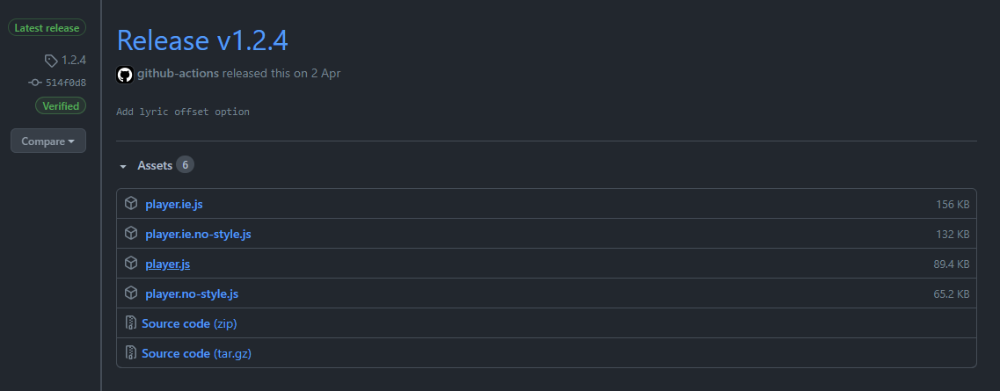

嗨多磨！这里是Leo。今天我将介绍如何在你的博客中全局加入一个基于网易云音乐的音乐播放器：[PenguinPlayer](https://github.com/M4TEC/PenguinPlayer)。

# 关于 PenguinPlayer

PenguinPlayer 是一个基于网易云音乐的轻量级迷你播放器。它使用 `TypeScript` 和 `Sass` 编写，可以通过引用 `player.js` 在你的任何网页上挂载。

- 移动/触控设备支持
- Internet Explorer 10+支持
- 简洁，好看还好用
- 使用简单

使用它，你首先需要有一个网易云歌单。

推荐使用 `pjax.js` 以获得无缝的体验。

# 配置

## 下载 PenguinPlayer

首先，你需要到[这里](https://github.com/M4TEC/PenguinPlayer/releases)下载最新版的 PenguinPlayer。

如果没有特别的需求，下载 `player.js` 就够了。



## 配置 PenguinPlayer

### 找到你的歌单 ID

先在网易云音乐上创建一个歌单。在浏览器中打开这个歌单，你就可以得到这个歌单的 URL。

举个例子：`https://music.163.com/#/playlist?id=6630417901`，其中，`playlist?id=` 后面的数字（如 `6630417901`）就是你的歌单ID。

### 配置 PenguinPlayer

你有两种方案可供选择：

- 直接修改 `player.js`
- 通过调用 PenguinPlayer 进行初始化（进阶）

#### 直接在 player.js 中配置

现在，打开下载下来的 JavaScript 文档，并在 `window` 上下文中设置你的歌单 ID。举个例子：`window.penguinplayer_id = "6630417901"`

#### 调用 `windows.PPlayer.initialize()` 以对播放器进行初始化

你也可以通过使用 `windows.PPlayer.initialize()`语句在其他地方对 PenguinPlayer 进行初始化操作。详见[进阶操作](# PenguinPlayer 的进阶操作)。

## 配置你的博客

这里以我使用的博客 `Hexo` 为例，主题是 `Yun`。

首先，把修改后的 `player.js` 复制到 `/source/js` 文件夹。

在主题配置文件 `yun.yml` 中，找到这几行：

```yaml
# pjax
pjax:
  enable: true
  src: /js/pjax.js

# stylesheets loaded in the <head>
css:
  - /css/hexo-theme-yun.css

# scripts loaded in the end of the body
js:
  - /js/utils.js
  - /js/hexo-theme-yun.js
```

然后在 `js` 部分添加：

```yaml
  - /js/player.js
```

这一步的目的是让网页在运行时加载 PenguinPlayer 的组件。

你也可以顺便就把 `pjax` 打开了。

# PenguinPlayer 的进阶操作

## 参数

事实上，PenguinPlayer 为你提供了更多的自定义参数。

你可以使用 `window.PPlayer.initialize(options: PenguinPlayerOptions)` 语句在对其初始化时对其进行配置。

所有可用的配置参数都在下表中展示：

| 参数                | 类型        | 描述                                                         |
| ------------------- | ----------- | ------------------------------------------------------------ |
| `playlist`          | `string`    | 这是你的歌单 ID。                                            |
| `startIndex?`       | `number`    | 指定一个在初始化后播放的歌曲序号，省略则随机选择。           |
| `overrideVolume?`   | `number`    | 在初始化时使用给定的音量值来取代播放器默认值或者缓存的值。   |
| `overridePlaymode?` | `Playmodes` | 在初始化时使用给定的播放模式来取代播放器默认值或者缓存的值。 |

## 不同版本

| 文件名                | 描述                                                         |
| --------------------- | ------------------------------------------------------------ |
| player.js             | **推荐！**这个版本能在现代浏览器中使用。                     |
| player.no-style.js    | 不包含样式的版本。                                           |
| player.ie.js          | 包含了为 `Internet Explorer` 准备的兼容代码的版本，如果你想要适配 IE 这种没人用的孤儿请使用这个版本。 |
| player.no-style.ie.js | `player.no-style.js`和`player.ie.js`的缝合怪（其实就是没有样式的 IE 版本） |

## API

播放器的所有接口都暴露在`window`上下文的`PPlayer`对象中

| 属性名                                                 | 描述                                                |
| ------------------------------------------------------ | --------------------------------------------------- |
| `initialize(id: string)`                               | 初始化播放器                                        |
| `play(index?: number)`                                 | 播放。如果指定`index`的值则会播放歌单相应位置的歌曲 |
| `pause()`                                              | 暂停                                                |
| `next()`                                               | 下一首                                              |
| `previous()`                                           | 上一首                                              |
| `addEventListener(name: string, handler: Function)`    | 添加一个事件监听器                                  |
| `removeEventListener(name: string, handler: Function)` | 移除一个事件监听器                                  |
| `volume`: `number`                                     | 音量。有效值在`0-1`之间                             |
| `currentTime`: `number`                                | 当前时间位置                                        |
| `duration`: `number`                                   | `getter` 歌曲时长                                   |
| `paused`: `boolean`                                    | `getter` 是否暂停                                   |
| `song`: `Song`                                         | 当前歌曲                                            |
| `playlist`: `Song[]`                                   | 歌单                                                |

# 尾声

你可以在[这里](http://afdian.net/@TenmaHiltonWhat)请作者[@TenmaHiltonWhat)](//github.com/tenmahiltonwhat)喝水。

你也可以在左栏关注我的 B 站频道。

你还可以在下面请我喝水。