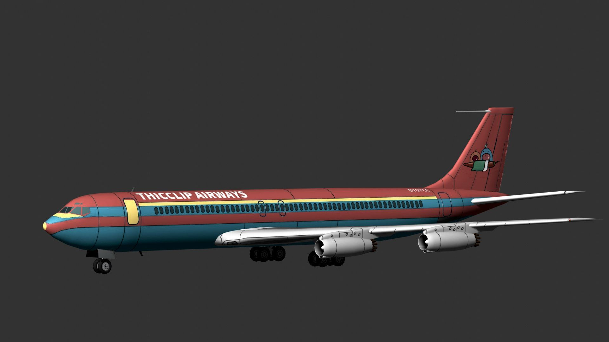

> **📢 声明**
> 本文为虚构内容，如有雷同，纯属巧合。

# 关于厚嘴唇航空公司 THICCLIP AIRWAYS

厚嘴唇航空公司（英文：THICCLIP Airways，航司二字代码：CC）是一家由旅居地球的厚嘴唇星人Cu夏和YuH创立的航空公司，总部位于中国上海市。厚嘴唇星位于银河系边缘，其居民因特征性的厚嘴唇而得名。航司英文名称“THICCLIP AIRWAYS”和二字代码中的“CC”灵感就源于这一特征，象征从上方俯视时的嘴唇形状。

<!--disclaimer: AI generated image-->

厚嘴唇航空公司位于上海的总部；图像由 DALL-E 3 生成。

# B-707CC：厚嘴唇航空公司的传奇客机

厚嘴唇航空公司拥有数百架喷气式与螺旋桨飞机，运营全球的观光游览航线；其中，与波音公司定制的 B707o 型飞机最为出名。该型飞机以大胆、活泼、且充满个性的桃红、柠黄、天蓝三色涂装而闻名，这不仅是一种视觉表达，更是厚嘴唇星人性格的象征。厚嘴唇星人作为宇宙中的一支独特群体，他们以乐观、外向且热情的性格著称。正如他们勇于跨越星际来到地球一样，他们喜欢挑战未知，敢于打破常规。

桃红色代表他们的温暖与包容，厚嘴唇星人天生善良友爱，乐于结交不同种族、文化背景的朋友；柠黄色则体现了他们活力四射的创造力和冒险精神，他们总是在寻求新鲜事物，敢于探索新领域，正因如此，他们成为了跨星际航行的先锋；天蓝色则象征着他们对未来的无限憧憬与自由追求，他们始终保持着对星空的仰望和对自由的渴望，希望通过自身的努力，打破时空限制，拉近星球间的距离。

这种特质也反映在厚嘴唇航空公司的服务中，无论是他们的航线设计、机上服务，还是整体氛围，都充满了热情与活力，给乘客带来前所未有的飞行体验，仿佛置身于宇宙探险之旅。同时，这些鲜艳的配色与飞行器设计，不仅是对厚嘴唇星人性格的展示，更传递了他们对地球文化的欣赏和对人类的尊重。

B-707CC 号飞机是厚嘴唇航空公司 B707o 型飞机中最具有纪念意义、最为传奇的一架。其注册号恰好包含了 707 飞机家族和厚嘴唇航空公司 CC。该架飞机正以 CC 7070 的航班号运营上海市到全国各地的旅游航线。很难说这到底是某种巧合或者缘分；总之，基于以上的原因，厚嘴唇航空公司 B-707CC 号飞机总是受到世界各地飞友的欢迎和追捧。

B-707CC 号传奇客机

幸运的是：现在，无需花费千元购买一张 CC 7070 航班的机票，您就可以在自己的设备上亲眼看到这架传奇飞机。

<image id="ar_img" src="ar_card.jpg" alt="AR 卡片"/>

您手里应该有一张具有如图所示图案的 AR 卡片。（翻个面看看？）

	
请使用 iPhone 或 iPad 的 Safari 浏览器打开该页面以体验增强现实（AR）卡片。不过，你仍然可以

	<button id="ar_entry">打开 AR 体验</button>
	<button id="usdz_model">查看 3D 模型 (USDZ 格式, 1:1)</button>
	<button id="usdz_001_model">查看 3D 模型 (USDZ 格式, 1:100)</button>
	<button id="webxr_entry">打开 WebXR 体验</button>
	<button id="glb_model">查看 3D 模型 (GLB 格式, 1:1)</button>
	<button id="glb_001_model">查看 3D 模型 (GLB 格式, 1:100)</button>

3D 模型需要一定时间加载，具体时间取决于您的网络状况。如果加载不出，请考虑使用代理。推荐使用 Safari、Chrome 或 Edge 等浏览器。

# 另附：《飞鸟说》合唱谱
点击[查看/下载](https://cdn.idealclover.cn/Projects/chilichill/feiniaoshuo.pdf)《飞鸟说》合唱谱（南京版，由 GaP *et al.* 制作）。
<object id="sheet_preview" data="https://cdn.idealclover.cn/Projects/chilichill/feiniaoshuo.pdf"
	type="application/pdf" width="100%">
	

		当前设备不支持在页面内预览 PDF 文件，请点击上方链接预览/下载。
	

</object>

# 尾注
[ChiliChill 官方网站](https://chilichill-music.com/) 
B707 aircraft model by manilov.ap on [SketchFab](https://sketchfab.com/3d-models/boeing707-83f77b7fe94f49e39b984c7390e9ecec), shared under CC 4.0 license. 
感谢 <a href="https://idealclover.cn/" target="_blank">idealclover</a> 大佬提供 CDN 托管以加速模型和曲谱文件的加载。

